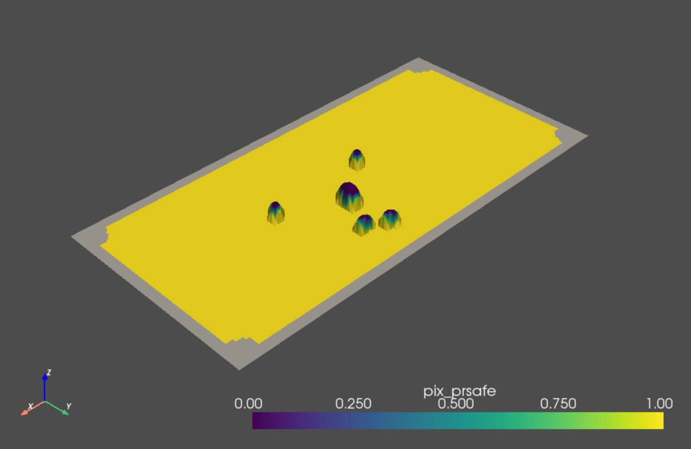
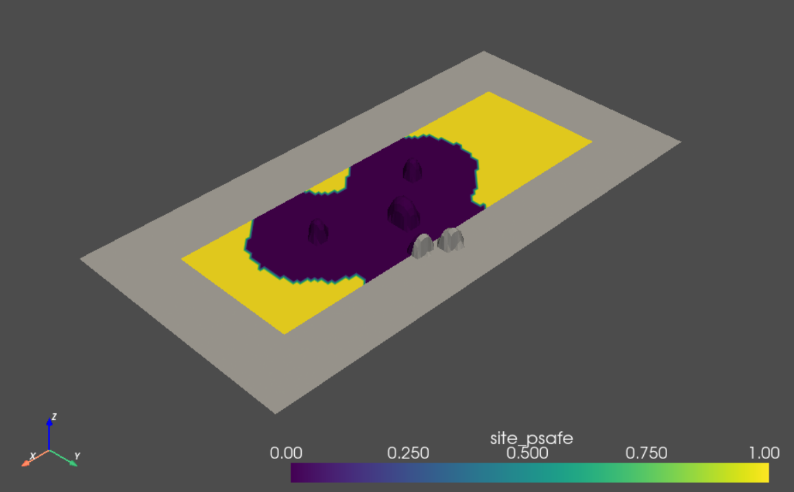

# PyDEM
PyDEM is a python library for 3D processing and visualization, minimally designed for landing hazard detection. 


## Installation
Clone this repository with
```bash
$ git clone https://github.com/kentotomita/pydem.git
```

## Dependencies
Core dependencies are
- `numba`, `numpy`, `matplotlib`, `scipy`, `trimesh`, `pyembree`, `pyvista`, `pyglet`

Although not necessary to run pydem, the following packages are also used optionally:
- `open3d` 

The python conda environment can be easily created with
```bash
$ conda env create -f environment.yml
```

<!-- USAGE EXAMPLES -->
## Quick Example 
Here is a quick example of running probabilistic hazard detection algorithm of ALHAT (Autonomous Landing Hazard Avoidance Technology) project, [proposed by Ivanov et. al.](https://arc.aiaa.org/doi/pdf/10.2514/6.2013-5019). 
You can also find a number of demo scripts in the `test` directory. 

First import some python modules and subpackages within `pydem` as
```python
import numpy as np
import pyvista as pv

import pydem.SyntheticTerrain as st
import pydem.Geometry as gm
import pydem.Graphic as pyvis
import pydem.HazardDetection as hd
import pydem.util as util
```
Construct a sample digital elevation map (DEM). Here let's create a flat terrain with random rocks. The resolution is set $0.1$ m/pix. 
```python
dem = st.rocky_terrain(shape=(128, 64), res=0.1, k=0.4, dmax=2., dmin=0.2)
```
Apply the ALHAT's probabilistic hazard detection algorithm to the DEM. Here the diameters of the lander and the landing pad are set $3.0$ m and $0.3$ m, respectively. The resolution is $0.1$ m/pix. 
```python
dl = 3.0
dp = 0.3
rmpp = 0.1

fpmap, site_slope, site_prsafe, pix_prsafe, psafe, indef = hd.alhat(
    dem, 
    rmpp=rmpp, 
    lander_type='square', 
    dl=dl, 
    dp=dp,
    scrit=10*np.pi/180,
    rcrit=0.3,
    sigma=0.05/3)
```
For 3D visualization, create a structured grid and add scalar attributes of the HD algorithm's outputs. Details of PyVista data models can be found [here](https://docs.pyvista.org/version/stable/user-guide/data_model.html).
```python
# Create mesh from DEM
h, w = dem.shape
x = np.linspace(0, 12.8, h)
y = np.linspace(0, 6.4, w)
yy, xx = np.meshgrid(y, x)
mesh = pv.StructuredGrid(xx, yy, dem)

# Add scalar attributes to mesh
mesh.point_data.set_array(fpmap.flatten('F'), 'fpmap')
mesh.point_data.set_array(site_slope.flatten('F'), 'site_slope')
mesh.point_data.set_array(site_prsafe.flatten('F'), 'site_prsafe')
mesh.point_data.set_array(pix_prsafe.flatten('F'), 'pix_prsafe')
mesh.point_data.set_array(psafe.flatten('F'), 'site_psafe')
```

We can now visualize the HD algorithm's output by activating the corresponding scalars. For example, probability of each pixel is safe in terms of roughness, is shown as follows.
```python
mesh.set_active_scalars('pix_prsafe')
mesh.plot()
```
<p align="center">
  
</p>

The probability that each pixel is safe as the landing target is shown as follows. 
```python
mesh.set_active_scalars('site_psafe')
mesh.plot()
```

<p align="center">
  
</p>